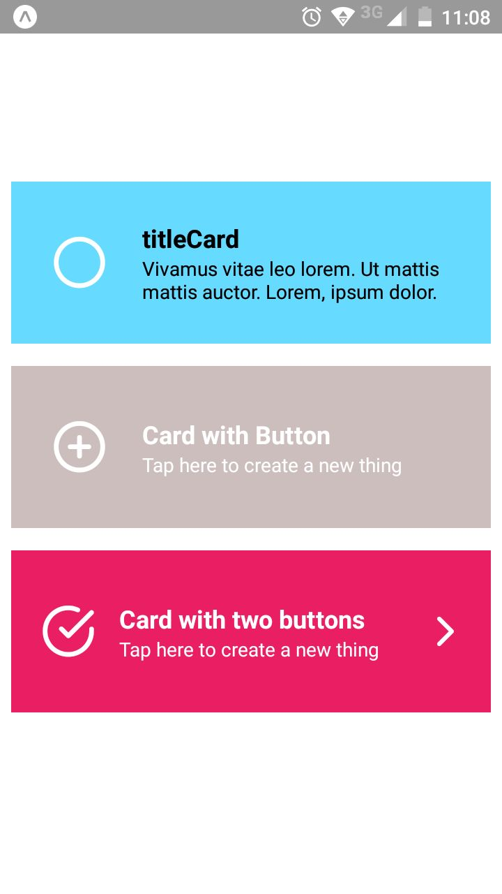
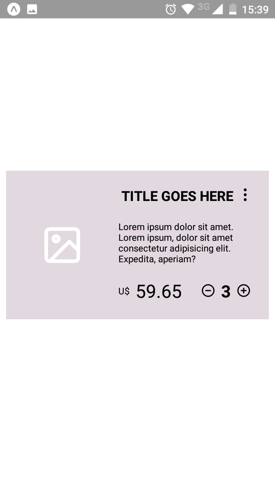

## Description

Reusable card components

  





## **Components**

  

* CardDefault

* CardWithButton

* CardWithTwoButton
* CardShop

  

## **Properties**

  

**Basics**

* icon

	* type: @expo/vector-icons

* titleCard

	* type : String

* textContent

	* type: String

* bgColor

	* type: String

* bgTextColor

	* type: String

**CardWithButton**

* onPressEvent()

	* type: function()

**CardWithTwoButton**

  

* iconLeft

	* type: @expo/vector-icons

* iconRight

	* type: @expo/vector-icons

* onPressLeftButton()

	* type: function()

* onPressRightButton()

	* type: function()

  
  

**CardShop**

  

* value

	* type: number

* price

	* type: float

* onPressMore()

	* type: function()

* setplusValue()

	* type: function()

* setminusValue()

	* type: function()

  
  

# Example

**Simple**

// in parent

```javascript

<CardDefault  title='titleCard'  bgTextColor='black' />

```

  

**Card with Buttons**

```javascript

// in parent

<CardWithButton  onPressEvent  =  {()=>  this.onPressCardComponent(

'pressed CardWithButton') }

/>

```

**Card with two Buttons**

```javascript

// in parent

<CardWithTwoButton
onPressLeftButton  =  { () =>  this.onPressCardComponent('pressed buttonLeft in CardWithTwoButton') }
onPressRightButton  =  { () =>  this.onPressCardComponent('pressed buttonRight in CardWithTwoButton') }
/>

```

**CardShop**

```javascript

// in parent

<CardShop
	price  =  '59.65'
	value  =  {this.state.valueCardShop}
	onPressMore  =  { () =>  this.onPressCardComponent('Pressed More in CardShop') }
	setplusValue  =  { () =>  this.setplusValueCardShop() }
	setminusValue  =  { () =>  this.setminusValueCardShop() }
/>

```